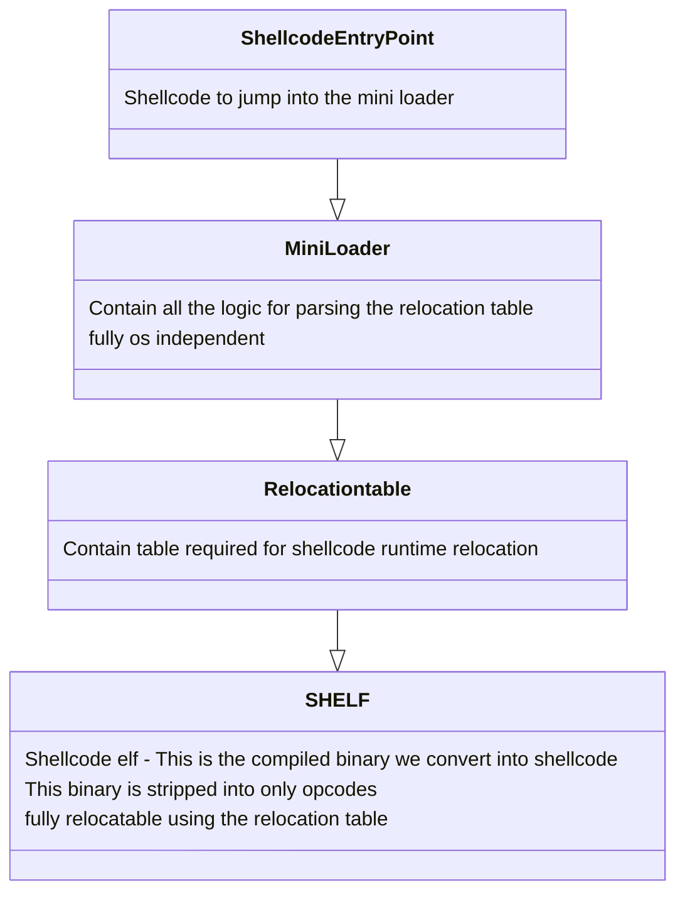

# Elf to shellcode
Convert standard elf files to standalone shellcodes.
Please read the following documentation and view the examples for this project to work properly

#### Project links
[Github](https://github.com/jonatanSh/elf_to_shellcode)

[Pypi](https://pypi.org/project/elf-to-shellcode/)

#### Supported architectures
* mips
* i386 (32bit)
* i386 (64bit)
* arm (32bit)
* aarch64 (arm 64 bit)

#### Installation:
```bash
pip install elf_to_shellcode
```
###### Python version support
* python3
* python2

## How does this work ?
The python library parses the elf and create a simple relocatable file format
Then the mini loader is inserted as the entry point of the elf the mini loader
will load the relocatable format and execute it.
There are no special requirements, the library contain the compiled
mini loaders.



This project is intended to convert elf to os independent shellcodes.
Therefor the loader never allocate memory and the shellcode format is not packed.
You can just execute it, eg ...
```c
((void (*)()) shellcode)();
```
note that __libc_start_main perform syscalls
therefor if you want your shellcode to be fully os independent you must compile with -nostartfiles
follow the examples below

## Creating a shellcode

Some compilation flags are required for this to work properly.
You must compile the binary with -fPIE and -static take a look at the provided examples below
(makefile).

shellcode is a stripped binary with no symbols and no elf information only opcodes, in order 
to make the shellcode this library require a binary with elf information.
so make sure you are not stripping the binary before using this library

simplified make command for mips big endian

```c
gcc example.c -fno-stack-protector -fPIE -fpic -static -nostartfiles --entry=main -o binary.out
python -m elf_to_shellcode --input binary.out --arch mips --endain big                                     
```

### Examples:

[Makefile](https://github.com/jonatanSh/elf_to_shellcode/blob/master/examples/Makefile)

[Example.c](https://github.com/jonatanSh/elf_to_shellcode/blob/master/examples/example.c)


### Testing your shellcode
You can use the provided shellcode
[Loader](https://github.com/jonatanSh/elf_to_shellcode/tree/master/shellcode_loader)
to test you shellcodes

```bash
qemu-mips ./shellcode_loader ./myshellcode.out
```

### Output example
```bash
Shellcode size = 66620
Allocating shellcode buffer, size = 69632
Mapping new memory, size = 69632
Jumping to shellcode, address = 0x7f7ee000
Hello from shellcode !
```

## Specific architecture limitations

### AARCH64

arm in 64 bit mode generate adrl instruction.
These instructions are (2 ** 12) aligned (page) therfore the shellcode should be
page aligned to overcome this limitation the shellcode is padded

## Advanced conceptes and features

for following links only work on the github page

* [Compiling with libc](docs/libc.md)
* [Dynamic shellcode](docs/dynamic.md)
* [Optimizations](docs/optimizations.md)
* [Output formats](docs/output_formats.md)
* [Development](docs/develop.md)
