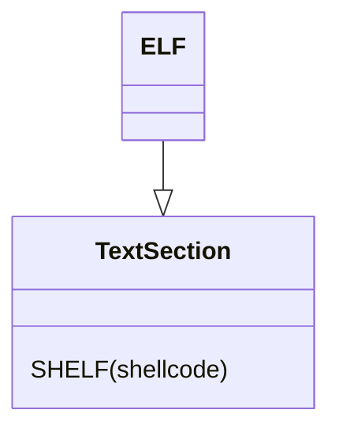

# ESHELF - Elf Shellcode ELF
This format wrap the output SHELF shellcode into a standalone elf.
This format is used for debug pruposes

## How does this work ?
This format build a new elf file and host the shelf inside that file.
then it changes the entry point of this new elf to point into the shellcode



## How to use
just add the following outputing option
```python
--output-fmt eshelf
```