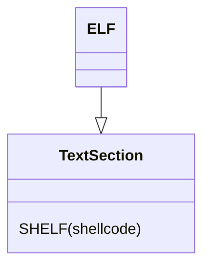

# ESHELF - Elf Shellcode ELF
This format wrap the output SHELF shellcode into a standalone elf.
This format is used for debug pruposes




## how to use
just add the following outputing option
```python
--output-fmt eshelf
```