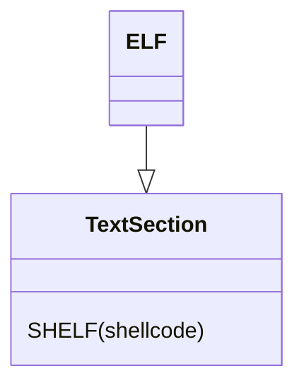

# ESHELF - Elf Shellcode ELF
This format wrap the output SHELF shellcode into a standalone elf.

This format is used for debug pruposes only and the shellcode only work on linux machines (due to specific syscalls)

## How does this work ?
Elf mini loaders are also provided in this package.
when this format is selected the loader is a full elf
we then modify the loader and add an executable section to it, we insert the shelf into that section



## How to use
just add the following outputing option
```bash
--output-format eshelf
```

### Supported architectures:

* intel x64
* intel x32
* mips
* arm32